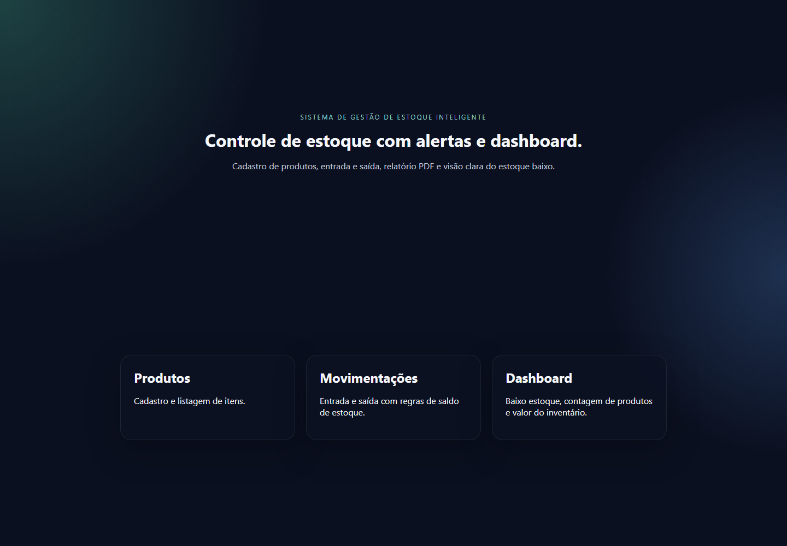

<h1>Sistema de Gestão de Estoque Inteligente</h1>

  
  
  
  

  Plataforma de controle de estoque desenvolvida para portfólio, com backend em Spring Boot e interface web em React. O projeto demonstra organização em camadas, persistência em PostgreSQL, autenticação com JWT e uma visão operacional do estoque por meio de dashboard e relatórios.

<h2>Visão Geral</h2>

  O sistema foi desenhado para simular um fluxo real de gestão de estoque em uma operação pequena ou média. Ele permite cadastrar produtos, registrar entradas e saídas, monitorar níveis mínimos e consultar informações consolidadas para apoio à decisão.

<h2>Stack</h2>
<ul>
  <li>Java 21</li>
  <li>Spring Boot</li>
  <li>Spring Security</li>
  <li>JWT</li>
  <li>PostgreSQL</li>
  <li>Docker</li>
  <li>React</li>
  <li>TypeScript</li>
  <li>Vite</li>
  <li>Swagger/OpenAPI</li>
  <li>JUnit</li>
  <li>Mockito</li>
</ul>

<h2>Funcionalidades</h2>
<ul>
  <li>Cadastro de produtos</li>
  <li>Controle de entrada e saída de itens</li>
  <li>Alerta de estoque baixo</li>
  <li>Dashboard operacional</li>
  <li>Relatórios de apoio à análise</li>
  <li>API documentada com Swagger</li>
</ul>

<h2>Arquitetura</h2>
<ul>
  <li><code>auth/</code> autenticação de usuários</li>
  <li><code>product/</code> cadastro e consulta de produtos</li>
  <li><code>movement/</code> movimentações de estoque</li>
  <li><code>dashboard/</code> indicadores consolidados</li>
  <li><code>report/</code> geração de relatórios</li>
  <li><code>security/</code> JWT e filtros de segurança</li>
  <li><code>config/</code> configuração da aplicação</li>
  <li><code>exception/</code> tratamento centralizado de erros</li>
</ul>

  A interface web consome a API por meio de chamadas isoladas, mantendo o frontend simples e de fácil manutenção.

<h2>Estrutura do Projeto</h2>
<ul>
  <li><code>backend/</code> aplicação Spring Boot</li>
  <li><code>frontend/</code> interface React</li>
  <li><code>docker-compose.yml</code> serviços de infraestrutura</li>
  <li><code>.env.example</code> variáveis de ambiente esperadas</li>
</ul>

<h2>Como Executar Localmente</h2>
<ol>
  <li>Copie <code>.env.example</code> para <code>.env</code>.</li>
  <li>Suba a infraestrutura:
    <pre><code>docker compose up -d</code></pre>
  </li>
  <li>Execute o backend:
    <pre><code>.\mvnw.cmd -f backend\pom.xml spring-boot:run</code></pre>
  </li>
  <li>Execute o frontend:
    <pre><code>cd frontend
npm install
npm run dev</code></pre>
  </li>
</ol>

<h2>Documentação da API</h2>

Com a aplicação ativa, a interface do Swagger está disponível em <code>http://localhost:8080/swagger-ui/index.html</code>.

<h2>Testes</h2>
<pre><code>.\mvnw.cmd -f backend\pom.xml test
cd frontend
npm run build</code></pre>

<h2>Captura de Execução</h2>

  

<h2>Decisões de Projeto</h2>
<ul>
  <li>PostgreSQL é usado como armazenamento principal.</li>
  <li>JWT protege os recursos sensíveis da API.</li>
  <li>O frontend foi mantido objetivo para refletir um produto funcional, não um protótipo visual.</li>
  <li>As regras de negócio ficam nos serviços para facilitar evolução e testes.</li>
</ul>

<h2>Melhorias Futuras</h2>
<ul>
  <li>adicionar filtros por categoria e nível de estoque;</li>
  <li>implementar exportação de relatórios em PDF;</li>
  <li>criar páginas de auditoria de movimentações;</li>
  <li>incluir testes de integração adicionais para o fluxo de estoque.</li>
</ul>
